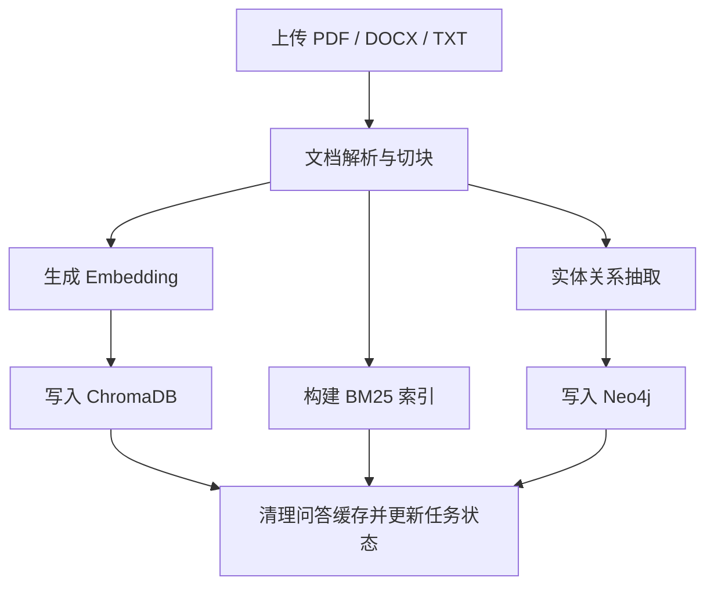
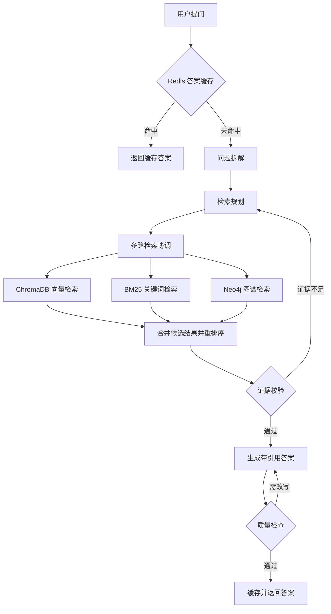
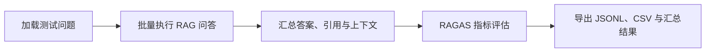

# 系统流程说明

本文档收录 Multi-Agent RAG 的核心工作流，供需要了解实现细节的读者参考。

## 文档入库

```mermaid
flowchart TD
  A[上传 PDF / DOCX / TXT] --> B[文档解析与切块]
  B --> C[生成 Embedding]
  C --> D[写入 ChromaDB]
  B --> E[构建 BM25 索引]
  B --> F[实体关系抽取]
  F --> G[写入 Neo4j]
  D --> H[清理问答缓存并更新任务状态]
  E --> H
  G --> H
```

## 智能问答

```mermaid
flowchart TD
  A[用户提问] --> B{Redis 答案缓存}
  B -->|命中| Z[返回缓存答案]
  B -->|未命中| C[问题拆解]
  C --> D[检索规划]
  D --> E[多路检索协调]
  E --> F[ChromaDB 向量检索]
  E --> G[BM25 关键词检索]
  E --> H[Neo4j 图谱检索]
  F --> I[合并候选结果并重排序]
  G --> I
  H --> I
  I --> J{证据校验}
  J -->|证据不足| D
  J -->|通过| K[生成带引用答案]
  K --> L{质量检查}
  L -->|需改写| K
  L -->|通过| M[缓存并返回答案]
```

## RAGAS 评估

```mermaid
flowchart LR
  A[加载测试问题] --> B[批量执行 RAG 问答]
  B --> C[汇总答案、引用与上下文]
  C --> D[RAGAS 指标评估]
  D --> E[导出 JSONL、CSV 与汇总结果]
```
